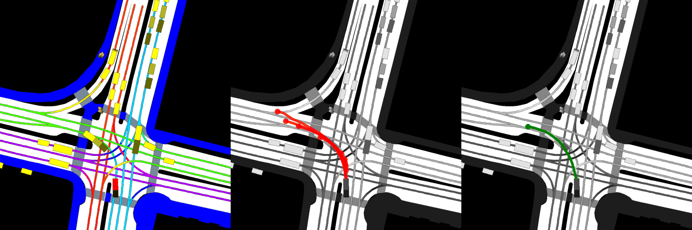

# socialea
Official PyTorch code for paper "[Q-EANet: Implicit social modeling for trajectory prediction via experience-anchored queries](http://doi.org/10.1049/itr2.12477 )"

# Overview

## Abstract: 
Accurately predicting the future trajectory and behavior of traffic participants is crucial for the maneuvers of self-driving vehicles. Many existing works employed a learning-based “encoder-interactor-decoder” structure, but they often fail to clearly articulate the relation-ship between module selections and real-world interactions. As a result, these approaches tend to rely on a simplistic stacking of attention modules. To address this issue, a tra-jectory prediction network (Q-EANet) is presented in this study, which integrates GRU encoders, MLPs and attention modules. By introducing a new explanatory rule, it makes a contribution to interpretable modeling, models the entire trajectory prediction process via an implicit social modeling formula. Inspired by the anchoring effect in decision psy-chology, the prediction task is formulated as an information query process that occurs before traffic participants make decisions. Specifically, Q-EANet uses GRUs to encode features and utilizes attention modules to aggregates interaction information for gener-ating the target trajectory anchors. Then, queries are introduced for further interaction. These queries, along with the trajectory anchors with added Gaussian noise, are then processed by a GRU-based decoder. The final prediction results are obtained through a Laplace MDN. Experimental results on the several benchmarks demonstrate the effec-tiveness of Q-EANet in trajectory prediction tasks. Compared to the existing works, the proposed method achieves state-of-the-art performance with only simple module design.

# Data Preparation
The code is primarily designed for the nuScenes motion prediction dataset.
To perform data preprocessing, please refer to [PGP](https://github.com/nachiket92/PGP), as this work utilizes its project structure.
The environment configuration is also consistent with it.

# Code Implementation
 Suppose that the data has undergone proper preprocessing and has been appropriately placed in their respective directory locations.

 To evaluate, just run:
 
 ```python
 python evaluate.py -config [XX/configs/ant.yml] -data_root [YOURS] -data_dir [YOURS] -output_dir [YOURS] -checkpoint [XX/outputs/checkpoints/best.tar]
 ```

# Citation
If you find this repository interesting and it has inspired you in certain ways, please consider citing our work:
```
@article{chen2023q,
  title={Q-EANet: Implicit social modeling for trajectory prediction via experience-anchored queries},
  author={Chen, Jiuyu and Wang, Zhongli and Wang, Jian and Cai, Baigen},
  journal={IET Intelligent Transport Systems},
  year={2023},
  publisher={Wiley Online Library}
}
```
